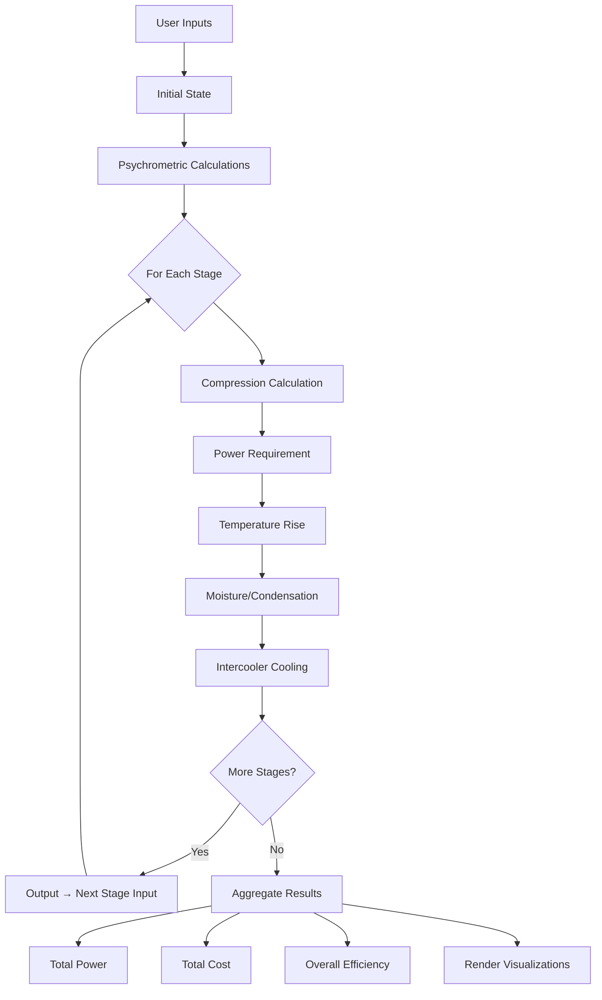

# Compressor Performance Analyzer

[](https://github.com/MrRogueKnight/Compressor-Performance-Analyzer)
[](https://github.com/MrRogueKnight/Compressor-Performance-Analyzer/releases)
[](LICENSE)
[](https://developer.mozilla.org/en-US/docs/Web/JavaScript)
[](http://makeapullrequest.com)
[](https://github.com/MrRogueKnight/Compressor-Performance-Analyzer/graphs/commit-activity)
[](https://github.com/MrRogueKnight/Compressor-Performance-Analyzer/issues)
[](https://github.com/MrRogueKnight/Compressor-Performance-Analyzer/stargazers)
[](https://github.com/MrRogueKnight/Compressor-Performance-Analyzer/network/members)

> **A Professional Thermodynamic Simulation Tool for Multi-Stage Air Compressor Systems**

---

## Table of Contents

- [Project Overview](#project-overview)
- [Key Features](#key-features)
- [Screenshots](#screenshots)
- [Quick Start](#quick-start)
- [Installation](#installation)
- [Usage](#usage)
- [Project Structure](#project-structure)
- [How It Works](#how-it-works)
- [Key Calculations](#key-calculations)
- [Technology Stack](#technology-stack)
- [Export Formats](#export-formats)
- [Example Use Cases](#example-use-cases)
- [Contributing](#contributing)
- [Author](#author)
- [License](#license)
- [Acknowledgments](#acknowledgments)
- [References](#references)
- [Support](#support)

---

## Project Overview

The **Compressor Performance Analyzer** is a sophisticated, browser-based thermodynamic simulation platform designed to help engineers, researchers, and students accurately analyze, optimize, and forecast the performance of multi-stage centrifugal air compressor systems.

Built on **ASME PTC 10** standards, this tool provides industry-grade accuracy in compression calculations, energy consumption forecasting, and cost analysis—making it invaluable for both professional engineering and academic research.

### Perfect For

| Field | Application |
|-------|-------------|
| **Industrial Engineering** | Compressor selection, facility planning, performance optimization |
| **Academic Research** | Thermodynamic education, thesis projects, simulation studies |
| **Energy Management** | Power consumption forecasting, efficiency audits |
| **Environmental Analysis** | Carbon footprint assessment, sustainability reporting |
| **Procurement** | Equipment specification, cost-benefit analysis |

---

## Key Features

### Core Capabilities

| Feature | Description |
|---------|-------------|
| **Multi-Stage Simulation** | Analyze 1-20 compressor stages with independent control |
| **Three Compression Models** | Polytropic, Isentropic, and Isothermal |
| **Psychrometric Calculations** | Advanced humidity, dew point, and condensation analysis |
| **Intercooler Simulation** | Model cooling between stages for improved efficiency |
| **Real-Time Analysis** | Instant power consumption and annual cost estimation |

### Visualization & Export

| Feature | Description |
|---------|-------------|
| **Interactive Charts** | P-V diagrams, T-S diagrams, performance curves |
| **PDF Reports** | Generate professional engineering reports |
| **CSV Export** | Export stage-by-stage data for external analysis |
| **JSON Projects** | Save and load complete configurations |
| **Responsive UI** | 7-section navigation with intuitive design |
| **Dark/Light Theme** | Professional dark and light mode support |

### Advanced Features

| Feature | Status | Description |
|---------|--------|-------------|
| **Configuration Comparison** | Available | Compare multiple setups side-by-side |
| **Carbon Footprint Tracking** | Available | Environmental impact analysis |
| **AI Optimization** | Available | Suggest optimal stage counts and pressures |
| **Multi-Gas Support** | Planned | Nitrogen, helium, CO2 support |

---

## Screenshots

### Main Dashboard

<div align="center">
  
  <br/>
  <sub><b>Main Dashboard - Input parameters and system configuration</b></sub>
</div>

<br/>

### Charts View

<div align="center">
  
  <br/>
  <sub><b>Charts View - Interactive performance visualizations</b></sub>
</div>

<br/>

### Results View

<div align="center">
  
  <br/>
  <sub><b>Results View - Performance metrics and cost analysis</b></sub>
</div>

<br/>

### PV & TS Diagrams

<div align="center">
  
  <br/>
  <sub><b>PV & TS Diagrams - Thermodynamic state diagrams</b></sub>
</div>

---

## Quick Start

### Prerequisites

- A modern web browser (Chrome, Firefox, Edge, or Safari)
- Internet connection (for CDN dependencies)
- Basic understanding of thermodynamics (helpful but not required)

### Installation

**Clone the repository:**

```bash
git clone https://github.com/MrRogueKnight/Compressor-Performance-Analyzer.git
cd Compressor-Performance-Analyzer
```

**Open the application:**

```bash
# Windows
start index.html

# macOS
open index.html

# Linux
xdg-open index.html
```

**Or simply double-click `index.html` in your file explorer!**

### Live Demo

Try the application online:
- **Live Demo:** [https://onecompiler.com/html/44u5r9q8x](https://onecompiler.com/html/44u5r9q8x)

---

## Usage

### Step-by-Step Guide

| Step | Action | Description |
|------|--------|-------------|
| 1 | **Open Application** | Launch `index.html` in your browser |
| 2 | **Navigate Sections** | Use sidebar menu to access different sections |
| 3 | **Input Parameters** | Enter atmospheric conditions and system specs |
| 4 | **Configure Stages** | Define compression stages and parameters |
| 5 | **Run Simulation** | Click "Calculate" to start the analysis |
| 6 | **View Results** | Review performance metrics, costs, and charts |
| 7 | **Export Data** | Generate PDF reports, CSV files, or JSON projects |

### Input Parameters

| Parameter | Value Range | Description |
|-----------|-------------|-------------|
| **Number of Stages** | 1-20 | Total compression stages |
| **Inlet Temperature** | -50°C to 60°C | Atmospheric temperature |
| **Inlet Pressure** | 0.5-2.0 bar | Atmospheric pressure |
| **Relative Humidity** | 0-100% | Ambient humidity |
| **Air Flow Rate** | 100-100,000 kg/hr | Mass flow of air |
| **Compression Type** | Polytropic/Isentropic/Isothermal | Compression model |
| **Polytropic Efficiency** | 70-95% | Stage efficiency |
| **Electricity Tariff** | 0.1-1.0 $/kWh | Operating cost rate |

---

## Installation

### No Build Process Needed!

This is a **zero-configuration** application. Simply open `index.html` and start using it.

### Optional: Serve with a Local HTTP Server

For advanced features (like proper JS modules loading), use:

```bash
# Using Python 3
python3 -m http.server 8000

# Using Node.js (http-server)
npx http-server

# Using PHP
php -S localhost:8000
```

Then visit `http://localhost:8000` in your browser.

---

## Project Structure

```
Compressor-Performance-Analyzer/
├── index.html                 # Main UI entry point
├── script.js                  # Application bootstrapper
├── styles.css                 # All styling & themes
├── screenshots/               # Application screenshots
│   ├── Main Dashboard.png
│   ├── Charts View.png
│   ├── Results View.png
│   └── PV & TS Diagrams.png
├── src/
│   ├── calculations/
│   │   ├── Compression.js     # ASME compression formulas
│   │   ├── Psychrometrics.js  # Humidity & moisture calculations
│   │   └── Simulator.js       # Main simulation engine
│   ├── charts/
│   │   └── ChartManager.js    # Chart.js integration & rendering
│   ├── constants/
│   │   └── thermo.js          # Physical constants & coefficients
│   ├── controllers/
│   │   └── Controller.js      # Application orchestrator
│   ├── models/
│   │   ├── AirState.js        # Thermodynamic state data model
│   │   ├── Atmosphere.js      # Initial conditions model
│   │   ├── Compressor.js      # System-level model
│   │   └── Stage.js           # Individual stage model
│   ├── ui/
│   │   ├── AtmosphericRenderer.js   # Condition display
│   │   ├── CarbonRenderer.js        # Environmental impact
│   │   ├── EnergyRenderer.js        # Cost & power display
│   │   ├── ProgressBar.js           # Calculation progress
│   │   ├── Renderer.js              # Base renderer class
│   │   └── ResultsRenderer.js       # Main results display
│   └── utils/
│       ├── units.js           # Unit conversion utilities
│       ├── utils.js           # General utility functions
│       └── validators.js      # Input validation rules
└── README.md                  # This file
```

---

## How It Works

### Simulation Pipeline



### Step-by-Step Process

1. **Input Collection:** User provides atmospheric conditions, flow rate, and compression parameters
2. **Initial State Setup:** Create thermodynamic state at inlet conditions
3. **Psychrometric Analysis:** Calculate humidity ratio, saturation pressure, dew point
4. **Stage-by-Stage Processing:**
   - Calculate compression using selected model (polytropic/isentropic/isothermal)
   - Compute power requirements
   - Determine temperature rise
   - Calculate moisture condensation
   - Apply intercooler cooling
   - Pass output state to next stage
5. **Results Aggregation:**
   - Sum total power consumption
   - Calculate annual operating cost
   - Determine overall efficiency
   - Generate warnings for inefficiencies
6. **Visualization:** Render charts, tables, and export-ready reports

---

## Key Calculations

All calculations follow **ASME PTC 10** standards for compressor performance testing.

### Compression Formulas

**Polytropic Index (n):**
```
n = ln(P_out/P_in) / ln(T_out/T_in)
```

**Polytropic Efficiency:**
```
eta_poly = ((n-1)/k) * (k/n) * 100%
```

**Power Required:**
```
P = m_dot * Cp * (T_out - T_in) / eta_poly
```

**Temperature Ratio:**
```
T_out/T_in = (P_out/P_in)^((n-1)/n)
```

### Psychrometric Calculations

**Saturation Pressure (Tetens Formula):**
```
P_sat = 0.61078 * exp((17.27 * T) / (T + 237.3))
```

**Humidity Ratio:**
```
omega = 0.622 * (phi * P_sat) / (P_atm - phi * P_sat)
```

**Dew Point Temperature:**
```
T_dp = (237.3 * ln(P_v/0.61078)) / (17.27 - ln(P_v/0.61078))
```

**Enthalpy of Moist Air:**
```
h = C_air * T + omega * (h_fg + C_vapor * T)
```

---

## Technology Stack

| Technology | Version | Purpose |
|-----------|---------|---------|
| **HTML5** | - | Page structure & semantic markup |
| **CSS3** | - | Responsive styling & theming |
| **JavaScript** | ES6+ | Core logic & calculations |
| **Chart.js** | 4.4.0 | Interactive data visualization |
| **jsPDF** | 2.5.1 | PDF report generation |
| **html2canvas** | 1.4.1 | Screenshot & export capability |

---

## Export Formats

| Format | Extension | Description |
|--------|-----------|-------------|
| **PDF Report** | `.pdf` | Complete simulation results, charts, and specifications |
| **CSV Data** | `.csv` | Stage-by-stage thermodynamic properties |
| **JSON Project** | `.json` | Full configuration for future loading |

---

## Example Use Cases

### Case 1: Industrial Facility Planning

**Scenario:** A manufacturing plant needs a new compressed air system.

**Requirements:** 1,526 kg/hr air at 131 bar, ambient 30.8°C, 68.3% RH

**Process:**
1. Input ambient conditions
2. Set target discharge pressure
3. Configure 5 stages with intercooling
4. Run simulation and analyze results
5. Export reports for procurement

**Results:** 5-stage system consuming 246 kW at 84.7% efficiency
- **Annual Energy Cost:** ₹14.78 Crores
- **CO2 Emissions:** 1,615.6 tons/year
- **Optimization:** Increase intercooler efficiency to 95% for savings

---

### Case 2: Academic Research

**Scenario:** University research on compressor efficiency improvement.

**Process:**
1. Model baseline system (5 stages, 88% intercooler)
2. Vary intercooler efficiency (70% to 95%)
3. Compare polytropic vs isentropic efficiency
4. Generate optimization charts
5. Export data for publication

**Contribution:** 15.5% energy savings with intercooler optimization

---

### Case 3: Environmental Impact Assessment

**Scenario:** Facility wants to reduce carbon footprint.

**Process:**
1. Calculate current power consumption (246.28 kW)
2. Model efficiency improvements
3. Compute CO2 reduction potential (1,615.6 tons/year)
4. Generate environmental impact reports
5. Present to sustainability team

**Outcome:** Identified 15.5% energy savings, 250 tons CO2 reduction potential

---

## Contributing

We welcome contributions from the community! Whether it's bug fixes, new features, or documentation improvements.

### How to Contribute

1. **Fork** the repository
2. **Create** a feature branch:
   ```bash
   git checkout -b feature/YourFeature
   ```
3. **Commit** your changes:
   ```bash
   git commit -m 'Add: YourFeature description'
   ```
4. **Push** to the branch:
   ```bash
   git push origin feature/YourFeature
   ```
5. **Open** a Pull Request with a clear description

### Contribution Areas

| Area | Examples |
|------|----------|
| Bug Fixes | Resolve issues, improve error handling |
| New Features | Additional compression models, export formats |
| Documentation | Improve README, add examples, create wiki |
| Testing | Unit tests, integration tests |
| UI/UX | Design improvements, accessibility |
| Localization | Translations for different languages |
| Code Quality | Optimization, refactoring, comments |

### Development Guidelines

- Follow existing code style and structure
- Use meaningful variable and function names
- Add comments for complex calculations
- Test thoroughly before submitting PR
- Reference ASME standards or academic sources
- Include clear commit messages

---

## Author

**MrRogueKnight**

[](https://github.com/MrRogueKnight)
[](https://twitter.com/MrRogueKnight)
[](https://linkedin.com/in/MrRogueKnight)
[](https://instagram.com/MrRogueKnight)

---

## License

This project is licensed under the **MIT License** - see the [LICENSE](LICENSE) file for details.

```text
MIT License

Copyright (c) 2026 MrRogueKnight

Permission is hereby granted, free of charge, to any person obtaining a copy
of this software and associated documentation files (the "Software"), to deal
in the Software without restriction, including without limitation the rights
to use, copy, modify, merge, publish, distribute, sublicense, and/or sell
copies of the Software, and to permit persons to whom the Software is
furnished to do so, subject to the following conditions:

The above copyright notice and this permission notice shall be included in all
copies or substantial portions of the Software.

THE SOFTWARE IS PROVIDED "AS IS", WITHOUT WARRANTY OF ANY KIND, EXPRESS OR
IMPLIED, INCLUDING BUT NOT LIMITED TO THE WARRANTIES OF MERCHANTABILITY,
FITNESS FOR A PARTICULAR PURPOSE AND NONINFRINGEMENT. IN NO EVENT SHALL THE
AUTHORS OR COPYRIGHT HOLDERS BE LIABLE FOR ANY CLAIM, DAMAGES OR OTHER
LIABILITY, WHETHER IN AN ACTION OF CONTRACT, TORT OR OTHERWISE, ARISING FROM,
OUT OF OR IN CONNECTION WITH THE SOFTWARE OR THE USE OR OTHER DEALINGS IN THE
SOFTWARE.
```

---

## Acknowledgments

| Individual/Organization | Contribution |
|-------------------------|--------------|
| **ASME** | PTC 10 Performance Test Code |
| **Chart.js** | Interactive charting library |
| **jsPDF & html2canvas** | PDF and image export functionality |
| **OpenAI** | AI optimization guidance |
| **Thermodynamics Community** | Industry standards and best practices |

---

## References

| Standard/Reference | Application |
|--------------------|-------------|
| **ASME PTC 10** | Centrifugal Compressor Performance Testing |
| **ISO 1217** | Industrial Compressed Air Compressors |
| **Tetens Formula** | Psychrometric calculations |
| **NIST REFPROP** | Fluid thermodynamic properties |
| **ASHRAE Handbook** | Psychrometric fundamentals |

---

## Support

### Found a Bug?
- [Open an Issue](https://github.com/MrRogueKnight/Compressor-Performance-Analyzer/issues)
- Provide clear description with steps to reproduce
- Include browser and OS information
- Attach screenshots if applicable

### Have a Question?
- Check existing [Discussions](https://github.com/MrRogueKnight/Compressor-Performance-Analyzer/discussions)
- Create a new discussion thread
- Tag with appropriate labels

### Feature Request?
- [Suggest a Feature](https://github.com/MrRogueKnight/Compressor-Performance-Analyzer/issues/new?labels=enhancement)
- Describe the feature and its use case
- Provide examples of how it would work

---

## Show Your Support

If this project helped you, please consider:

| Action | Impact |
|--------|--------|
| Star the repository | Increases visibility |
| Share with colleagues | Helps the community |
| Contribute improvements | Makes the tool better |
| Cite in academic work | Supports research |
| Report issues | Improves quality |

---

## Project Stats

[](https://github.com/MrRogueKnight/Compressor-Performance-Analyzer/issues)
[](https://github.com/MrRogueKnight/Compressor-Performance-Analyzer/pulls)
[](https://github.com/MrRogueKnight/Compressor-Performance-Analyzer/graphs/contributors)
[](https://github.com/MrRogueKnight/Compressor-Performance-Analyzer/graphs/commit-activity)

---

<div align="center">

**Made for engineers and students worldwide.**

---

[Back to Top](#compressor-performance-analyzer)

</div>
